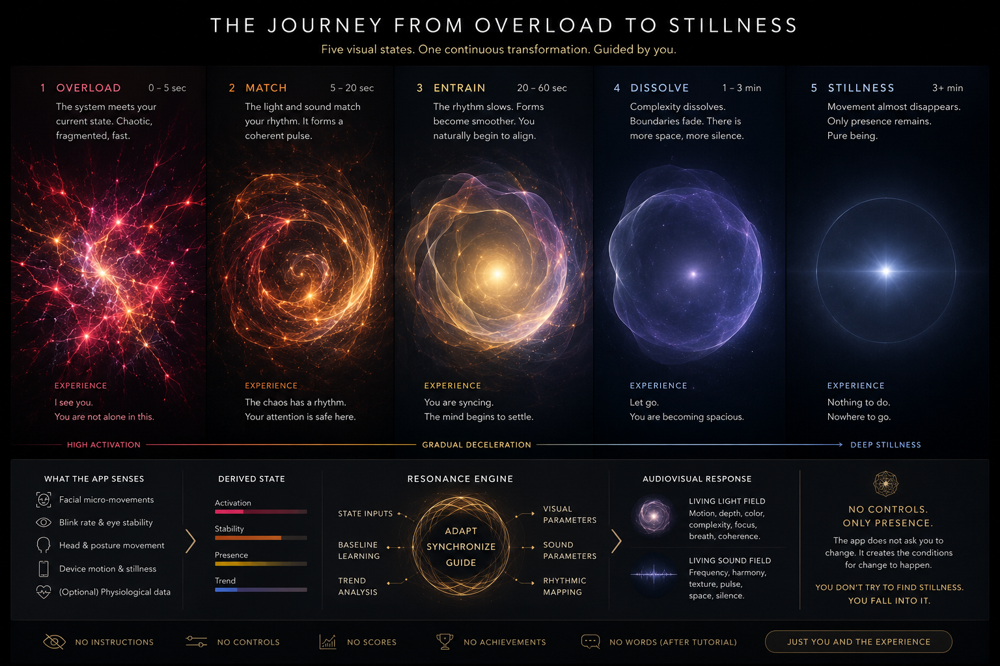
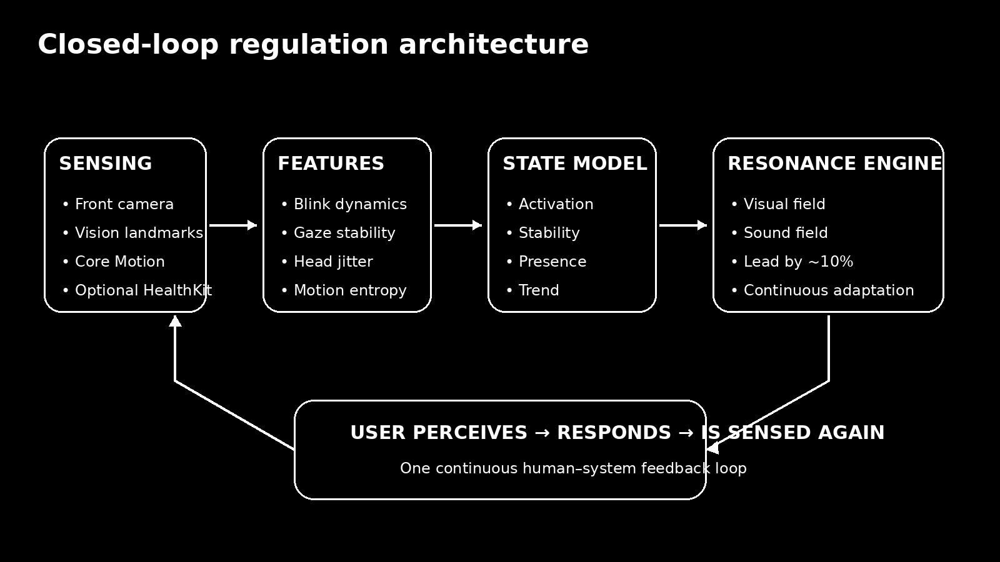
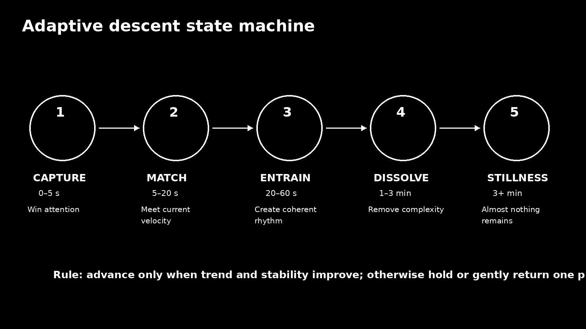

# Stillness — iOS Implementation Plan

> **Product thesis:** an adaptive audiovisual presence that meets the mind at its current velocity, captures attention, synchronises with it, and progressively decelerates until almost nothing remains to attend to.



---

## 1. Goal

Build an iPhone experience that:

1. opens directly into a full-screen visual field;
2. passively observes behavioural signs of activation and settling;
3. estimates a **regulation state**, not a diagnosis or emotion label;
4. immediately renders a beautiful audiovisual state that feels close to the user's current velocity;
5. leads the user slightly toward greater coherence;
6. continuously checks whether the user follows;
7. progressively removes visual and sonic complexity;
8. ends in sustained stillness rather than a score, reward, or content screen.

### Core product constraint

**No active controls during the experience.**

Controls may exist in onboarding, permissions, accessibility, privacy, and developer/debug modes. The primary session is:

> Open → look → be met → descend.

---

## 2. MVP scope

### Include

- iPhone portrait experience.
- Front camera.
- Apple Vision face landmarks and face tracking.
- Core Motion device motion.
- Local, on-device feature extraction.
- Personal rolling baseline.
- Four derived state axes:
  - `activation`
  - `stability`
  - `presence`
  - `trend`
- Five experience phases:
  - Capture
  - Match
  - Entrain
  - Dissolve
  - Stillness
- Metal-based procedural light field.
- AVAudioEngine-based generative sound field.
- Shared resonance timeline for audio and visual events.
- Local session summaries for calibration.
- No account required.
- No raw video storage.

### Explicitly exclude from MVP

- Stress diagnosis.
- Anxiety classification.
- Emotion recognition labels such as angry/sad/happy.
- Cloud inference.
- Social features.
- Meditation library.
- Spoken guidance.
- Gamification.
- Apple Watch dependency.
- EDA dependency.
- “Healing frequency” claims.
- Adaptive ML trained on population labels.

---

## 3. Technical architecture



```text
AVCaptureSession
      │
      ▼
VisionProcessor ──────────────┐
                              │
CMMotionManager ──────────────┤
                              ▼
                       FeatureExtractor
                              │
                        rolling windows
                              │
                              ▼
                        BaselineModel
                              │
                              ▼
                         StateEstimator
                 activation / stability
                    presence / trend
                              │
                              ▼
                         PhaseController
                              │
                              ▼
                        ResonanceEngine
                         /           \
                        /             \
                       ▼               ▼
               VisualParameterBus  AudioParameterBus
                       │               │
                       ▼               ▼
                MetalRenderer      AudioEngine
                        \             /
                         \           /
                          USER PERCEPTION
                                │
                                └──── feedback loop
```

### Recommended stack

| Area | Technology |
|---|---|
| App shell | SwiftUI |
| Camera | AVFoundation |
| Face analysis | Vision |
| Motion | Core Motion |
| Rendering | Metal + MetalKit |
| Audio | AVFAudio / AVAudioEngine |
| State concurrency | Swift actors |
| Persistence | SwiftData or small Codable store |
| Optional health data | HealthKit |
| Tests | XCTest + Swift Testing where appropriate |
| Performance | Instruments, Metal System Trace, Time Profiler |

### Architectural rule

**Sensing must never directly manipulate visual or audio properties.**

Use:

```text
sensor → feature → state → target resonance → smoothed render parameters
```

Never:

```text
blink → flash light
head movement → move particle
```

The latter makes the experience feel like a reactive toy or camera effect. The user should perceive a coherent presence, not input mapping.

---

## 4. Experience state machine



The phases are experiential control regimes, not discrete screens.

```swift
enum RegulationPhase: Sendable {
    case capture
    case match
    case entrain
    case dissolve
    case stillness
}
```

## 4.1 Capture — approximately 0–5 seconds

### Objective

Win the attention contest.

### Behaviour

- Immediate visual presence.
- Strong local contrast against near-black.
- Rich internal detail.
- Motion concentrated around one dominant attractor.
- Audio texture appears as part of the same event.
- System begins calibration immediately.
- Do not wait for a confident state estimate before rendering.

### Important

The first frame should already be beautiful.

Cold camera calibration must happen behind the experience.

### State behaviour

Use a prior state:

```swift
StateEstimate(
    activation: 0.65,
    stability: 0.35,
    presence: 0.50,
    trend: 0.0,
    confidence: 0.0
)
```

Blend toward measured state as confidence rises.

---

## 4.2 Match — approximately 5–20 seconds

### Objective

Make the experience feel congruent with the user's current velocity.

### Behaviour

- Adapt motion density.
- Adapt temporal irregularity.
- Adapt field fragmentation.
- Adapt harmonic tension.
- Search for a dominant rhythmic period.
- Visual/auditory pulse should become coherent.

### Rule

**Reflect first, then lead.**

```text
render target = estimated user state × 0.90
```

Conceptually, the system renders a state approximately **10% more regulated** than the current estimate.

This value is a tunable design parameter, not a scientific constant.

---

## 4.3 Entrain — approximately 20–60 seconds

### Objective

Create a coherent audiovisual oscillator the user naturally follows.

### Behaviour

- Decrease temporal entropy.
- Increase phase coherence between audio and visual events.
- Slowly lengthen the dominant pulse.
- Reduce competing focal points.
- Move energy toward a central attractor.
- Preserve enough complexity to retain attention.

### Example pulse progression

```text
3.8 s
4.0 s
4.3 s
4.6 s
4.9 s
5.2 s
```

Do **not** progress on a timer alone.

Advance only when the user state trend supports it.

---

## 4.4 Dissolve — approximately 1–3 minutes

### Objective

Remove the apparatus that was holding attention.

### Behaviour

- Reduce particle count.
- Increase field continuity.
- Reduce edge density.
- Reduce local contrast.
- Widen sonic space.
- Increase decay.
- Remove rhythmic subdivisions.
- Make events less frequent.
- Allow darkness to occupy more of the display.

The experience must become less interesting **without becoming boring**.

This is a central design challenge.

---

## 4.5 Stillness — 3 minutes onward, variable

### Objective

Allow sustained presence without requiring attention.

### Behaviour

- Almost no macroscopic movement.
- Extremely slow low-amplitude field drift.
- One stable luminous concentration.
- No reward animation.
- No success screen.
- Audio approaches silence.
- Very subtle response if activation returns.

### Exit

The user exits naturally.

Do not interrupt stillness with:

> Session complete.

A session summary can exist outside the primary experience and should never automatically cover the stillness field.

---

## 5. Sensing model

The app should estimate **observable regulation proxies**.

It must not claim to read thoughts or determine a psychiatric state.

## 5.1 Camera pipeline

```text
Front camera
  ↓
CVPixelBuffer
  ↓
Vision face detection / tracking
  ↓
Face landmarks
  ↓
Normalised geometric measurements
  ↓
Temporal feature windows
```

### Initial Vision features

Capture normalized, timestamped observations:

```swift
struct FaceObservationSample: Sendable {
    let timestamp: TimeInterval
    let faceCenter: SIMD2<Float>
    let faceScale: Float
    let roll: Float
    let yawProxy: Float
    let leftEyeAperture: Float
    let rightEyeAperture: Float
    let browEyeDistance: Float
    let mouthAperture: Float
    let landmarkMotion: Float
    let trackingConfidence: Float
}
```

### Derive, do not classify

Useful rolling features:

#### Blink dynamics

- estimated blink rate;
- inter-blink interval variance;
- bilateral eye closure synchrony;
- burst behaviour.

#### Gaze proxy

Do not market this as precise eye tracking.

Estimate:

- eye-region geometric stability;
- face-relative eye movement;
- duration of stable visual orientation;
- abrupt changes.

#### Head dynamics

- position variance;
- angular variance;
- velocity;
- jerk;
- direction-change frequency;
- micro-movement spectral energy.

#### Facial motion

Calculate normalized landmark displacement after removing:

- whole-head translation;
- scale;
- rotation.

This gives a rough facial motion energy signal.

### Performance target

Do not run full landmark analysis at display frame rate.

Start with:

```text
camera capture:       30 fps
Vision analysis:      10–15 fps
visual rendering:     60/120 fps where available
state estimation:     5–10 Hz
phase policy:         2–5 Hz
```

Profile on actual devices.

---

## 5.2 Motion pipeline

Use `CMMotionManager` device-motion updates.

Sample:

```swift
struct MotionSample: Sendable {
    let timestamp: TimeInterval
    let rotationRate: SIMD3<Double>
    let userAcceleration: SIMD3<Double>
    let gravity: SIMD3<Double>
}
```

Derive:

- acceleration RMS;
- rotation RMS;
- jerk;
- motion burst count;
- motion entropy;
- stillness streak;
- device orientation stability.

### Important ambiguity

Phone motion is not body motion.

A user may place the phone on a stand or surface. Therefore:

- treat low device motion as supporting evidence;
- never make device stillness a required signal for calm;
- detect persistent static-device mode and reweight the model.

---

## 5.3 Optional physiological data

Later versions may request authorised HealthKit data.

Possible inputs include compatible heart-related data and electrodermal activity samples where such data is available from a source.

### Product rule

The core experience must remain useful without a wearable.

Optional physiology should increase confidence and personalisation, not unlock the product.

---

## 6. Feature extraction

All feature calculations operate on rolling windows.

Recommended windows:

```text
short:   1.5 s
medium:  8 s
long:    30 s
baseline: multi-session
```

### Generic temporal feature

```swift
struct TemporalMetric: Sendable {
    let current: Double
    let shortMean: Double
    let mediumMean: Double
    let shortVariance: Double
    let mediumVariance: Double
    let slope: Double
}
```

### Feature vector v0

```swift
struct RegulationFeatures: Sendable {
    // Face
    let blinkRate: Double
    let blinkIrregularity: Double
    let eyeStability: Double
    let headVelocity: Double
    let headJerk: Double
    let headDirectionChangeRate: Double
    let facialMotionEnergy: Double

    // Device
    let deviceMotionEnergy: Double
    let deviceMotionEntropy: Double
    let deviceStillnessDuration: Double

    // Interaction / observation quality
    let facePresence: Double
    let observationConfidence: Double

    // Dynamics
    let globalSettlingSlope: Double
}
```

### Preprocessing

1. reject low-confidence samples;
2. normalise face geometry by face size;
3. remove gross head transform from landmark motion;
4. winsorize extreme sensor spikes;
5. smooth raw derived metrics;
6. calculate personal z-scores against the current baseline.

---

## 7. Personal baseline

The model should primarily compare the user with themselves.

```swift
struct PersonalBaseline: Codable, Sendable {
    var blinkRate: RunningDistribution
    var blinkIrregularity: RunningDistribution
    var eyeStability: RunningDistribution
    var headVelocity: RunningDistribution
    var headJerk: RunningDistribution
    var facialMotionEnergy: RunningDistribution
    var deviceMotionEnergy: RunningDistribution
}
```

### Baseline strategy

#### Session 1

Use broad conservative priors.

The first session should work as an audiovisual journey even when sensing confidence is low.

#### Sessions 2–5

Blend priors with user observations.

```text
baseline = prior × decreasingWeight + personalData × increasingWeight
```

#### Mature baseline

Update slowly.

Do not let one highly activated session redefine “normal”.

Recommended approach:

- robust median;
- median absolute deviation;
- bounded exponential updates;
- session-level weighting;
- outlier suppression.

### Separate baseline from target

The user's normal state is **not** automatically the desired stillness target.

Baseline answers:

> Is this unusual for this person?

The descent model answers:

> Are observable signals becoming more coherent and stable over this session?

---

## 8. Derived state model

```swift
struct StateEstimate: Sendable, Equatable {
    let activation: Double   // 0...1
    let stability: Double    // 0...1
    let presence: Double     // 0...1
    let trend: Double        // -1...1
    let confidence: Double   // 0...1
}
```

## 8.1 Activation

A weighted estimate from personal deviations in:

- head velocity;
- head jerk;
- facial motion energy;
- blink burst behaviour;
- device motion energy;
- motion entropy.

Pseudo-model:

```text
activation =
    0.22 × headJerkZ
  + 0.18 × headVelocityZ
  + 0.18 × facialMotionEnergyZ
  + 0.14 × blinkIrregularityZ
  + 0.12 × deviceMotionEnergyZ
  + 0.16 × motionEntropyZ
```

Weights are prototype defaults only.

They must be validated experimentally.

## 8.2 Stability

Estimate coherence over time.

Inputs:

- inverse movement variance;
- stable orientation streak;
- eye-region stability;
- lower direction-change rate;
- sustained low jerk.

## 8.3 Presence

Do **not** equate direct staring with mindfulness.

For v0, `presence` is an interaction-quality estimate:

- face is present;
- orientation supports viewing;
- observation continuity is good;
- visual orientation is relatively stable.

This helps determine whether the loop has usable input.

## 8.4 Trend

Trend is the most important derived value.

Calculate change in a composite regulation signal:

```text
regulation = stability - activation
```

Then calculate robust slope across medium and long windows.

```text
trend < 0  → moving away from regulation
trend ≈ 0  → holding
trend > 0  → settling
```

### State model implementation order

**v0:** deterministic weighted model.

**v1:** tune coefficients from instrumented internal sessions.

**v2:** personalised adaptive weights.

**v3:** only consider ML after enough consented data exists and a precise prediction target has been defined.

Do not begin with a black-box “stress AI”.

---

## 9. Phase controller

The phase controller decides the current experiential regime.

```swift
actor PhaseController {
    private(set) var phase: RegulationPhase = .capture

    func update(
        state: StateEstimate,
        sessionTime: Duration
    ) -> PhaseDecision {
        // policy
    }
}
```

### Example transition policy

```text
CAPTURE → MATCH
when:
- minimum 3 seconds elapsed
- presence confidence > threshold
OR
- hard fallback at 7 seconds

MATCH → ENTRAIN
when:
- coherent rhythm target established
- observation confidence is adequate
- user has remained engaged

ENTRAIN → DISSOLVE
when:
- trend positive for sustained window
- stability rises
- activation falls relative to session peak

DISSOLVE → STILLNESS
when:
- high stability sustained
- activation low relative to personal/session baseline
- trend is non-negative
- no recent activation rebound
```

### Regression policy

Never snap backward.

Example:

```text
Stillness activation rebound
  ↓
increase field amplitude slowly
  ↓
restore one harmonic layer
  ↓
return to late Dissolve parameters
```

The app should feel like it notices the user, not like it failed a level.

---

## 10. Resonance engine

This is the creative core.

The resonance engine receives the current estimated state and phase and produces one common evolving audiovisual world.

```swift
struct ResonanceState: Sendable {
    let pulsePeriod: Double
    let pulseCoherence: Double
    let temporalEntropy: Double
    let spatialEntropy: Double
    let energy: Double
    let depth: Double
    let focus: Double
    let harmonicTension: Double
    let spectralDensity: Double
    let silence: Double
}
```

### State mapping

```swift
protocol ResonanceMapping: Sendable {
    func target(
        for state: StateEstimate,
        phase: RegulationPhase
    ) -> ResonanceState
}
```

### Lead-by-10% policy

The visual should usually target a slightly more regulated state than the estimator reports.

```swift
let guidance = 0.10

let guidedActivation = max(
    0,
    state.activation - guidance * state.confidence
)

let guidedStability = min(
    1,
    state.stability + guidance * state.confidence
)
```

### Critical smoothing rule

Never linearly map noisy sensor values to rendered properties.

Every target passes through a parameter smoother.

```swift
struct SmoothedParameter {
    var current: Double
    var velocity: Double

    mutating func step(
        toward target: Double,
        deltaTime: Double,
        response: Double
    ) -> Double {
        // critically damped spring or equivalent
    }
}
```

Different parameters require different response times:

```text
attention capture energy:   300–700 ms
visual turbulence:          2–5 s
dominant pulse period:      8–20 s
harmonic tension:           4–12 s
depth / dissolution:        15–60 s
silence:                    20–90 s
```

The slow parameters give the system dignity.

---

## 11. Visual engine

### Visual thesis

Not an orb.

Not a face.

Not an avatar.

Create a **living field of light with ambiguous scale**.

The user should not know whether they are seeing:

- a cell;
- a star;
- an eye;
- plasma;
- a universe;
- a consciousness-like presence.

### Metal implementation

Use `MTKView` hosted inside SwiftUI.

Suggested pipeline:

```text
MetalLightView
  ↓
LightFieldRenderer
  ├─ simulation pass
  ├─ particle/advection pass
  ├─ volumetric field pass
  ├─ bloom/glow pass
  ├─ subtle chromatic pass
  └─ final composition
```

### MVP renderer approach

Avoid a large physically correct particle simulation initially.

Use a procedural GPU field:

1. signed/noise field;
2. curl-like flow;
3. a small number of attractors;
4. ray-marched or layered luminous density;
5. temporal modulation from the resonance timeline;
6. high-quality bloom;
7. depth cue from multi-layer parallax.

### Shader parameter block

```metal
struct LightFieldUniforms {
    float time;
    float deltaTime;

    float energy;
    float temporalEntropy;
    float spatialEntropy;
    float coherence;

    float pulsePhase;
    float pulseAmplitude;

    float depth;
    float focus;
    float dissolution;
    float stillness;

    float3 primaryLight;
    float3 secondaryLight;
    float3 accentLight;
};
```

### Visual mappings

#### Activation

Increase:

- velocity;
- small-scale flow;
- filament density;
- local luminance variation;
- event frequency.

#### Stability

Increase:

- field continuity;
- alignment;
- persistence;
- smooth advection.

#### Entrainment

Increase:

- phase coherence;
- repeated macro-motion;
- central attraction.

#### Dissolution

Decrease:

- number of visible structures;
- edge density;
- chromatic complexity;
- competing attractors.

Increase:

- negative space;
- depth continuity;
- slow decay.

#### Stillness

Approach:

```text
velocity → near zero
entropy → minimum
pulse amplitude → minimum
field boundary → indistinct
focal attractors → one
```

### Colour

Do not use a discrete red-to-blue stress gradient.

Create a continuous colour manifold.

Example anchor regions:

```text
activation:
deep crimson
hot rose
amber-white filaments

match:
burnt gold
copper
deep magenta traces

entrain:
gold
violet
soft ultraviolet

dissolve:
indigo
silver-violet
deep blue-black

stillness:
near-white blue
moon silver
almost colourless light
```

Implement colour as interpolation in a perceptual colour space where practical rather than raw RGB linear interpolation.

### Depth illusion

Use:

- gyroscope-informed subtle parallax;
- multiple light-density layers;
- depth-dependent blur;
- occlusion-like density;
- centre field behind the apparent display plane.

**Do not map every physical phone movement to parallax.**

Clamp aggressively.

The effect should be discovered, not demonstrated.

---

## 12. Audio engine

### Principle

The sound is not background music.

**The sound and light are two renderers of the same resonance state.**

Use `AVAudioEngine`.

Suggested graph:

```text
Tone/Drone Nodes ───┐
Texture Nodes ──────┤
Pulse Node ─────────┤
Resonance Events ───┤
                    ▼
               Main Mixer
                    │
              Spatial/FX bus
                    │
                 Output
```

### Generative layers

#### Foundation

- low, slowly evolving tonal bed;
- minimal pitch motion;
- very long amplitude curves.

#### Texture

- filtered noise;
- granular-like surface;
- high-frequency detail correlated with visual micro-turbulence.

#### Pulse

- not a metronome;
- broad amplitude or timbral swell;
- shared `pulsePhase` with the visual field.

#### Resolution events

Rare coherent events where:

- harmonics align;
- visual filaments converge;
- spectral tension falls;
- luminance briefly resolves.

These events can become attention anchors.

### Frequency claims

Do not implement the product around claims that fixed tuning frequencies produce specific emotional or medical outcomes.

The implementation can absolutely manipulate:

- oscillator frequency;
- tuning;
- beating;
- spectral centroid;
- amplitude modulation rate;
- rhythmic periodicity;
- harmonic consonance/tension.

Treat these as creative and psychoacoustic parameters to prototype and test.

### Shared clock

Use one high-resolution resonance timeline.

```swift
actor ResonanceClock {
    private(set) var phase: Double = 0
    private(set) var period: Double = 4.0

    func advance(by delta: Double) -> ResonanceTick {
        // shared temporal state
    }
}
```

Audio scheduling and the visual renderer consume the same conceptual phase.

Do not attempt to sync by having the visual layer “listen” to rendered audio.

---

## 13. Attention capture design

The initial visual has one job:

> Within approximately five seconds, the user should stop mentally operating the app.

### Prototype three capture mechanisms

#### A. Convergent filaments

Many high-detail paths move toward a hidden attractor.

The eye searches for the organizing principle.

#### B. Near-formation

The field repeatedly approaches a coherent form but does not fully resolve.

This creates anticipation.

#### C. Impossible depth event

A luminous event appears to pass deeper than the physical display.

This creates perceptual surprise.

### Recommendation

Start with **A + subtle C**.

Avoid making Capture highly random. Random noise does not necessarily hold attention.

The motion must imply hidden order.

---

## 14. Peripheral re-engagement

Later prototype only.

When the user appears to disengage:

1. do not flash;
2. do not increase global brightness;
3. do not play a notification-like sound;
4. introduce one low-amplitude peripheral motion;
5. introduce a subtle unresolved audio partial;
6. if visual orientation returns, allow the event to resolve.

This requires careful ethics and UX testing.

The app should support regulation, not build an attention trap.

Implement a strict cap on re-engagement attempts.

---

## 15. Privacy model

This should be a product feature.

### Default guarantees

- camera processing on device;
- no raw camera frames persisted;
- no raw camera frames uploaded;
- no face identity model;
- no face recognition;
- no emotion label stored;
- session features stored only when required for baseline adaptation;
- user can delete calibration data;
- optional HealthKit access requested separately and contextually.

### Data model

Store distributions and aggregates rather than observation streams where possible.

Prefer:

```text
median head motion
motion dispersion
blink interval distribution
session regulation slope
```

Avoid storing:

```text
timestamped facial landmark history for every frame
```

### Debug mode

For development builds, allow a local visual overlay.

```text
activation  0.71
stability   0.33
presence    0.84
trend      +0.08
confidence  0.77
phase       MATCH
```

Never show this during the consumer experience.

---

## 16. Suggested Xcode project structure

```text
Stillness/
├── App/
│   ├── StillnessApp.swift
│   └── AppEnvironment.swift
│
├── Experience/
│   ├── ExperienceView.swift
│   ├── ExperienceCoordinator.swift
│   ├── PhaseController.swift
│   └── RegulationPhase.swift
│
├── Sensing/
│   ├── Camera/
│   │   ├── CameraService.swift
│   │   ├── VisionProcessor.swift
│   │   └── FaceObservationSample.swift
│   ├── Motion/
│   │   ├── MotionService.swift
│   │   └── MotionSample.swift
│   └── SensorFusion/
│       └── ObservationTimeline.swift
│
├── State/
│   ├── FeatureExtractor.swift
│   ├── RegulationFeatures.swift
│   ├── StateEstimator.swift
│   ├── StateEstimate.swift
│   ├── PersonalBaseline.swift
│   └── RunningDistribution.swift
│
├── Resonance/
│   ├── ResonanceEngine.swift
│   ├── ResonanceState.swift
│   ├── ResonanceMapping.swift
│   ├── ResonanceClock.swift
│   └── SmoothedParameter.swift
│
├── Visual/
│   ├── MetalLightView.swift
│   ├── LightFieldRenderer.swift
│   ├── LightFieldUniforms.swift
│   └── Shaders/
│       ├── LightField.metal
│       ├── FlowField.metal
│       └── Composite.metal
│
├── Audio/
│   ├── StillnessAudioEngine.swift
│   ├── AudioParameterBus.swift
│   ├── DroneVoice.swift
│   ├── TextureVoice.swift
│   └── PulseVoice.swift
│
├── Calibration/
│   ├── BaselineStore.swift
│   └── CalibrationPolicy.swift
│
├── Privacy/
│   └── DataRetentionPolicy.swift
│
└── Debug/
    ├── StateOverlay.swift
    └── SensorRecorder.swift
```

---

## 17. Core concurrency model

Use actors around mutable sensing and state engines.

```swift
@MainActor
final class ExperienceCoordinator: ObservableObject {
    private let sensing: SensingCoordinator
    private let estimator: StateEstimator
    private let resonance: ResonanceEngine

    @Published private(set) var phase: RegulationPhase = .capture
}
```

Recommended ownership:

```text
MainActor
  ExperienceCoordinator
      │
      ├── CameraService actor / capture queue
      ├── MotionService actor
      ├── FeatureExtractor actor
      ├── StateEstimator actor
      ├── PhaseController actor
      └── ResonanceEngine actor

Metal render thread consumes atomic/snapshotted render state.
Audio scheduling consumes audio parameter snapshots.
```

Do not block camera processing on rendering or audio.

Use bounded queues or latest-value semantics.

Old state estimates should be discarded rather than replayed late.

---

## 18. Instrumentation

The first prototype is a research instrument.

Log locally in debug builds:

```text
session time
feature vector
state estimate
confidence
phase
resonance target
render parameters
audio parameters
frame duration
Vision processing latency
state processing latency
phase transitions
```

### Session review tool

Build a simple internal timeline viewer.

```text
activation ─────╲________
stability  ____╱─────────
trend      ___+++++++____
phase      C M E E D D S
```

This will be more useful than guessing why a session “felt wrong”.

---

## 19. Testing strategy

## Unit tests

### Feature extractor

- blink intervals;
- landmark transform normalization;
- motion RMS;
- jerk;
- entropy;
- rolling slope;
- low-confidence rejection.

### Baseline

- robust update;
- outlier suppression;
- no single-session baseline collapse;
- persistence.

### State estimator

Fixture feature vectors:

```text
high activation
settling
stable calm
poor observation confidence
static phone
high facial expression but low movement trend
```

Assert bounded and monotonic output properties where expected.

### Phase controller

Test:

- minimum phase durations;
- positive transition;
- no transition on low confidence;
- gentle regression;
- activation rebound;
- missing face;
- app interruption.

### Resonance engine

Assert:

- bounded parameters;
- no discontinuities beyond threshold;
- increasing stillness reduces entropy;
- pulse period changes slowly;
- confidence controls guidance strength.

## Integration tests

Feed recorded **feature streams**, not raw faces, into:

```text
StateEstimator → PhaseController → ResonanceEngine
```

Snapshot the resulting resonance timeline.

## Visual validation

Use deterministic seeds for shader development.

Capture known state vectors:

```text
A1 activation=1.0 stability=0.0
A2 activation=0.7 stability=0.3
A3 activation=0.4 stability=0.6
A4 activation=0.2 stability=0.8
A5 activation=0.05 stability=0.95
```

Review for a continuous visual journey.

---

## 20. Prototype milestones

## Milestone 0 — Fake-state visual descent

**Question:** can the visual mechanism itself pull attention toward stillness?

Build:

- full-screen Metal light field;
- developer slider for `activation`;
- developer slider for `stability`;
- automatic 3-minute scripted descent;
- shared audio/visual pulse;
- no camera.

### Success criterion

A user describes a clear subjective descent from:

> activated → held → slower → spacious → still

without instructions.

**Do this first.**

---

## Milestone 1 — Resonance engine

Build:

- `ResonanceState`;
- parameter smoothers;
- common resonance clock;
- visual parameter bus;
- audio parameter bus.

Remove direct state-to-shader mappings.

### Success criterion

Changing one internal state creates a coherent audiovisual transformation.

---

## Milestone 2 — Camera sensing

Build:

- camera service;
- Vision face landmarks;
- normalized sample stream;
- debug landmark renderer;
- rolling face features.

### Success criterion

Stable feature streams across:

- face distance changes;
- modest head rotation;
- common room lighting;
- glasses where Vision remains confident.

---

## Milestone 3 — Motion fusion

Build:

- Core Motion sampling;
- motion feature extraction;
- static-device detection;
- feature fusion.

### Success criterion

Handheld fidgeting affects movement evidence while a supported/static phone does not invalidate regulation estimation.

---

## Milestone 4 — State estimator

Build deterministic v0.

Add debug state overlay and session recording.

### Success criterion

The state estimator is temporally stable and tracks obvious within-person settling trends during internal tests.

Do **not** require accurate population-level stress classification.

---

## Milestone 5 — Closed loop

Connect:

```text
state → phase → resonance → user → state
```

### Success criterion

The system adapts differently for:

- user settles quickly;
- user remains activated;
- user begins settling then rebounds;
- user looks away;
- sensing confidence temporarily drops.

---

## Milestone 6 — First-use calibration

Build silent calibration inside the experience.

No “calibrating…” screen.

### Success criterion

First session remains compelling with low personal baseline confidence; later sessions become more personally responsive.

---

## Milestone 7 — Privacy and App Store readiness

Build:

- camera permission copy;
- optional HealthKit permission flow;
- local baseline deletion;
- privacy explanation;
- app lifecycle handling;
- interruption handling;
- battery/performance profiling.

Review product wording to avoid diagnostic or unsupported medical claims.

---

## 21. First two-week engineering sprint

### Day 1–2

- Create SwiftUI app shell.
- Add `MTKView`.
- Render black field and luminous centre.
- Add deterministic time and seeded noise.

### Day 3–4

- Implement procedural flow field.
- Add spatial entropy.
- Add temporal entropy.
- Add coherence.
- Add depth layers and subtle parallax.

### Day 5

- Add `ResonanceState`.
- Add spring/smoothed parameters.
- Create scripted Capture → Stillness descent.

### Day 6–7

- Add AVAudioEngine.
- Build drone voice.
- Build texture voice.
- Build broad pulse.
- Drive audio and light from common phase.

### Day 8

- Tune visual capture.
- Prototype convergent filaments.
- Add one impossible-depth event.
- Remove anything that looks like a screensaver.

### Day 9–10

- Add camera capture.
- Run Vision landmarks at a lower processing cadence.
- Build debug overlay.
- Log normalized observations.

### Day 11

- Add Core Motion.
- Implement rolling metrics.
- Add static-device detection.

### Day 12

- Implement `RegulationFeatures`.
- Implement personal-session baseline.
- Build v0 state estimator.

### Day 13

- Implement phase policy.
- Connect state to the resonance target.
- Add guidance offset.

### Day 14

- Run internal sessions.
- Review timelines.
- Tune only the most obvious failure modes.
- Record next hypotheses.

---

## 22. Research protocol for the first prototype

The primary early question is **not**:

> Can the app detect stress?

It is:

> Can a closed-loop audiovisual field reduce observable activation and increase sustained stillness faster or more naturally than a non-adaptive version?

### Prototype conditions

#### A — adaptive

State drives resonance.

#### B — scripted

Same visual quality; fixed descent.

#### C — static calm

Begins immediately in a calm/still state.

### Initial observations

Measure:

- time until gaze/orientation stabilises;
- movement-energy slope;
- duration of sustained low movement;
- rebound frequency;
- voluntary session duration.

After the experience, ask only a few questions:

```text
Did it feel like it met you where you were?
Did you feel pulled or instructed?
At any point did it become irritating?
Did the final stillness feel empty or complete?
```

Avoid long wellness questionnaires during early visual mechanism testing.

---

## 23. Key product hypotheses

### H1 — Congruence

A high-activation user responds better when the system initially matches some of their temporal intensity than when it starts fully calm.

### H2 — Coherent lead

A visual field rendered slightly more regulated than the estimated user state produces a stronger settling trend than exact mirroring.

### H3 — Audiovisual unity

Shared phase and event timing create stronger attentional capture than ambient music placed behind an adaptive visual.

### H4 — Progressive subtraction

Reducing stimulus as stability increases supports longer stillness than maintaining a continuously beautiful high-detail visual.

### H5 — Personal baseline

Within-person deviation and session trend are more useful to the experience than universal “stressed face” classification.

Build the product to test these hypotheses.

---

## 24. Critical risks

### False certainty

The system will sometimes infer the wrong state.

**Mitigation:** state confidence, multi-signal fusion, slow mapping, no labels shown to users.

### User performance

The user may discover that being motionless changes the field and deliberately “game” it.

**Mitigation:** no metrics, no progress indicator, multi-window dynamics, do not equate motionlessness with stillness.

### Screensaver effect

The visual is beautiful but emotionally inert.

**Mitigation:** hidden order, coherent state response, anticipation, shared audiovisual events.

### Overstimulation

Capture may intensify an already activated state.

**Mitigation:** match velocity without maximizing brightness, contrast, flash rate, or audio intensity; cap activation rendering.

### Attention trap

Re-engagement mechanics may conflict with the intention of stillness.

**Mitigation:** sparse re-engagement, hard attempt limits, explicit internal ethical rule: the system progressively relinquishes attention.

### Medical positioning

Marketing may overclaim stress detection or treatment.

**Mitigation:** describe regulation proxies and adaptive calming experience accurately; obtain specialist regulatory/legal review before health claims.

---

## 25. Product language

### Use

- adaptive audiovisual experience;
- signs of activation and settling;
- responsive to your state;
- regulation;
- coherence;
- stillness;
- on-device sensing.

### Avoid without evidence and regulatory review

- reads your mental state;
- detects anxiety;
- diagnoses stress;
- treats panic attacks;
- clinically proven;
- healing frequencies;
- nervous-system reset.

Internally, the ambition can remain profound.

Externally, the claims must remain precise.

---

## 26. The first implementation decision

**Build the visual descent before the stress estimator.**

The first working branch should contain:

```text
MTKView
ResonanceState
ResonanceEngine
scripted StateEstimate sequence
LightFieldRenderer
AVAudioEngine
shared pulse phase
```

Then create a debug gesture or development panel that moves the state from:

```swift
StateEstimate(
    activation: 0.95,
    stability: 0.10,
    presence: 0.75,
    trend: -0.10,
    confidence: 1.0
)
```

to:

```swift
StateEstimate(
    activation: 0.03,
    stability: 0.97,
    presence: 0.85,
    trend: 0.05,
    confidence: 1.0
)
```

over three minutes.

The most important first deliverable is a single continuous visual transformation where **the final frame feels inevitable given the first**.

Only after that works should live sensing be allowed to drive it.

---

## 27. Definition of MVP success

The MVP succeeds when a user can open the app in an activated state and, without selecting a mode or following an instruction:

1. becomes visually captured;
2. feels that the experience is congruent rather than falsely calm;
3. naturally follows its deceleration;
4. remains through progressive visual subtraction;
5. reaches a period of sustained stillness;
6. describes the system as having **responded to them**, even though no state or metric was shown.

The intended impression is not:

> I completed a meditation.

It is:

> **Something met me, and the noise disappeared.**

---

## 28. Primary Apple implementation references

- Vision — https://developer.apple.com/documentation/vision
- VNDetectFaceLandmarksRequest — https://developer.apple.com/documentation/vision/vndetectfacelandmarksrequest
- Real-time face tracking with Vision — https://developer.apple.com/documentation/vision/tracking-the-user-s-face-in-real-time
- Core Motion — https://developer.apple.com/documentation/coremotion/
- CMMotionManager — https://developer.apple.com/documentation/coremotion/cmmotionmanager
- CMDeviceMotion — https://developer.apple.com/documentation/coremotion/cmdevicemotion
- MTKView — https://developer.apple.com/documentation/metalkit/mtkview
- AVAudioEngine — https://developer.apple.com/documentation/avfaudio/avaudioengine
- HealthKit electrodermal activity quantity type — https://developer.apple.com/documentation/healthkit/hkquantitytypeidentifier/electrodermalactivity
